# TryHackMe Pickle Rick Writeup

> [!WARNING]
> **Spoiler warning:** This writeup explains the complete solution path for the TryHackMe Pickle Rick room. The final room answers are redacted in this public version.

An authorized lab walkthrough covering web enumeration, command execution, privilege context, and ingredient discovery.

| Item | Details |
| --- | --- |
| Platform | TryHackMe |
| Room | [Pickle Rick](https://tryhackme.com/room/picklerick) |
| Difficulty | Easy |
| Target | `<MACHINE_IP>` |

## Downloads

- [Sanitized Word report](Pickle-Rick-Writeup-Redacted.docx)
- [Sanitized PDF report](Pickle-Rick-Writeup-Redacted.pdf)

The target address is represented as `<MACHINE_IP>` because TryHackMe assigns a temporary IP address whenever the machine is deployed.

## Table of contents

- [Reconnaissance](#reconnaissance)
- [Web enumeration](#web-enumeration)
  - [HTML source inspection](#html-source-inspection)
  - [Directory enumeration](#directory-enumeration)
  - [Credential discovery in robots.txt](#credential-discovery-in-robotstxt)
- [Authentication](#authentication)
- [Command execution and the first ingredient](#command-execution-and-the-first-ingredient)
- [Locating the second ingredient](#locating-the-second-ingredient)
- [Privilege context and the final ingredient](#privilege-context-and-the-final-ingredient)
- [Security findings](#security-findings)
- [Remediation](#remediation)
- [Lessons learned](#lessons-learned)

## Reconnaissance

I began with a basic Nmap scan to identify reachable TCP services on the target.

```bash
nmap <MACHINE_IP>
```

The scan identified two open ports:

- `22/tcp` - SSH
- `80/tcp` - HTTP

Because the challenge presents a web application, I prioritized the HTTP service for further investigation.

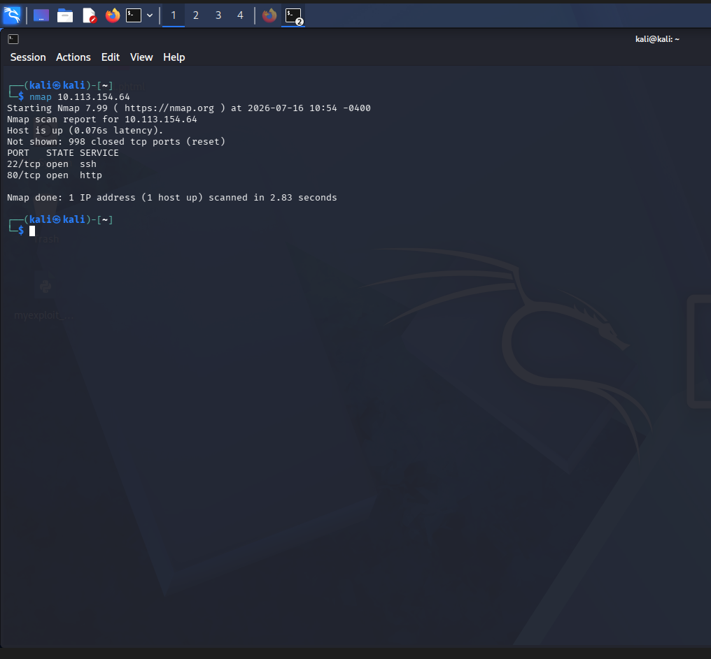

## Web enumeration

### HTML source inspection

I opened the web application and inspected the HTML source. A developer comment exposed a username that could be used for authentication.

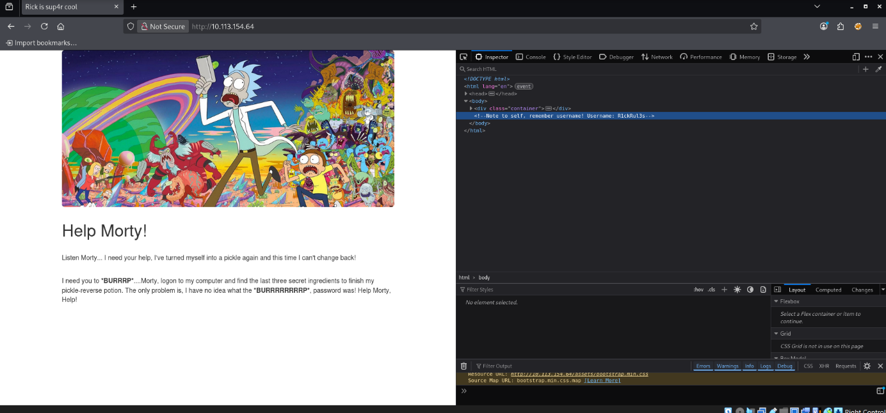

**Username:** `R1ckRul3s`

### Directory enumeration

I used Gobuster with PHP, HTML, and TXT extensions to identify resources that were not linked directly from the home page.

```bash
gobuster dir -u http://<MACHINE_IP> -w /usr/share/wordlists/dirb/common.txt -x php,html,txt
```

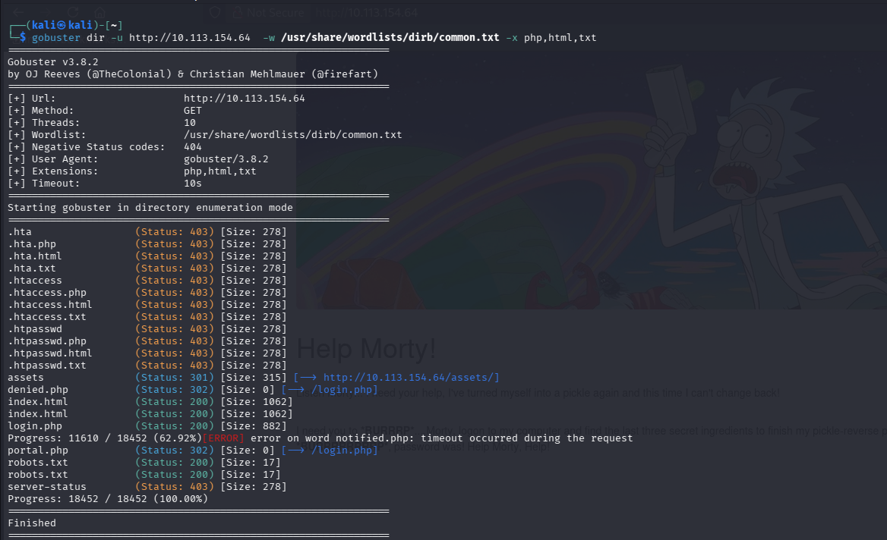

The results included `login.php`, `robots.txt`, and `portal.php`. The `302` redirect from `portal.php` to `login.php` indicated that the command portal required authentication.

### Credential discovery in robots.txt

I inspected `robots.txt` before attempting to log in. Instead of normal crawler directives, the file contained a standalone string. I treated this value as a password candidate for the username discovered in the page source.

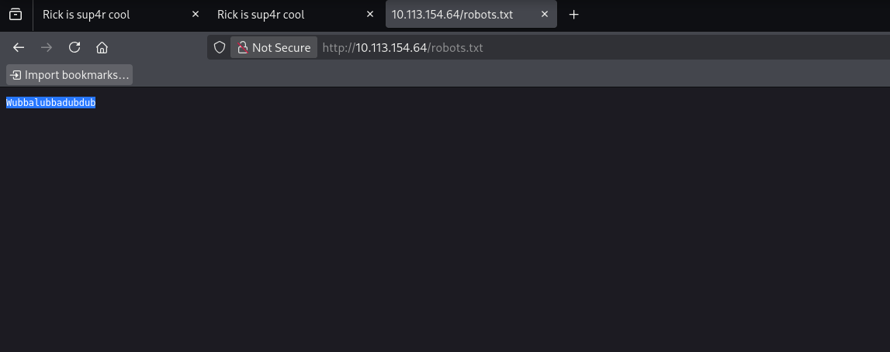

**Password candidate:** `Wubbalubbadubdub`

## Authentication

I submitted the discovered username and password on `login.php`. Authentication succeeded and the application redirected me to the command panel at `portal.php`.

**Credentials:** `R1ckRul3s / Wubbalubbadubdub`

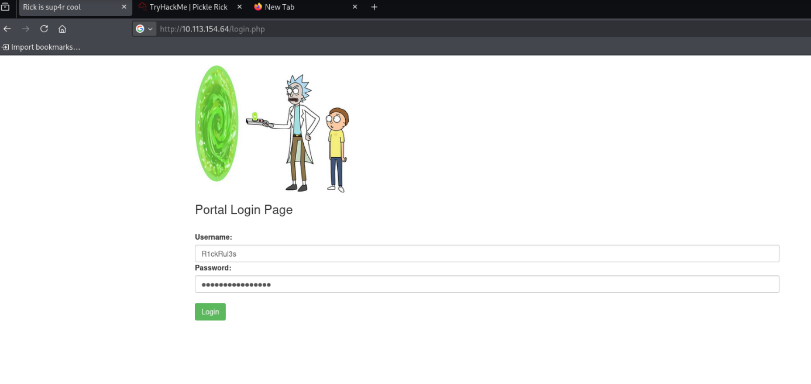

## Command execution and the first ingredient

The authenticated portal accepted operating-system commands. I first listed the contents of the current web directory.

```bash
ls
```

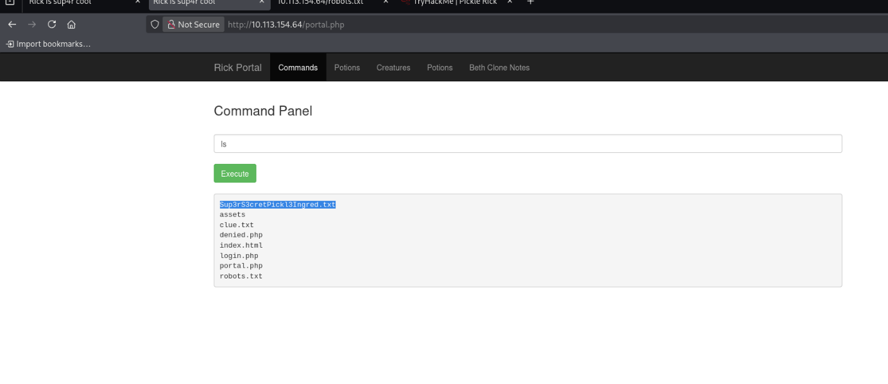

The listing revealed `Sup3rS3cretPickl3Ingred.txt`. I used `less` to display the contents of the file.

```bash
less Sup3rS3cretPickl3Ingred.txt
```

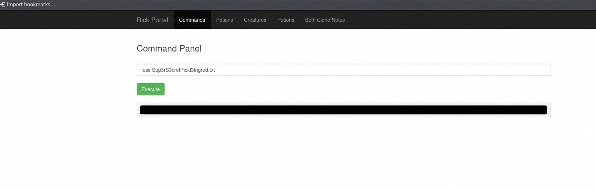

**First ingredient:** `[REDACTED]`

## Locating the second ingredient

After finding the first ingredient in the web directory, I enumerated the root filesystem and followed the user directories under `/home`.

```bash
ls /
```

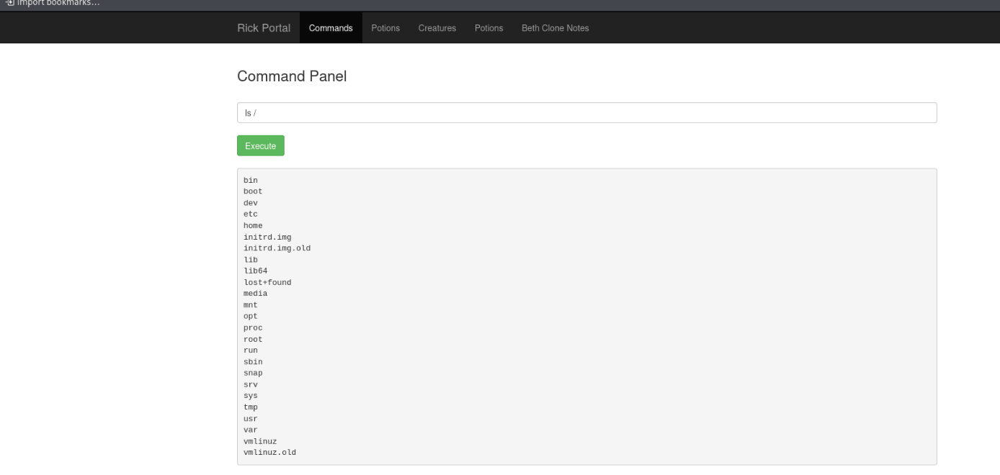

```bash
ls /home
```

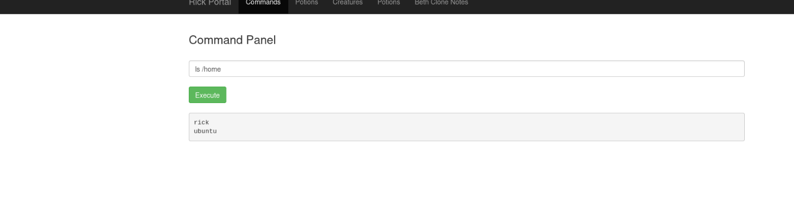

```bash
ls /home/rick
```

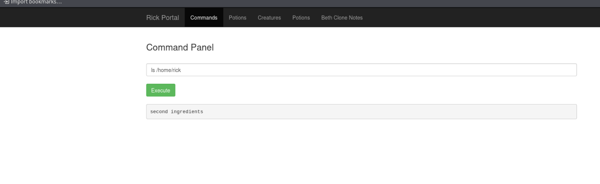

The filename contains a space, so I enclosed it in straight double quotes to ensure that the shell treated the complete name as one argument.

```bash
less /home/rick/"second ingredients"
```

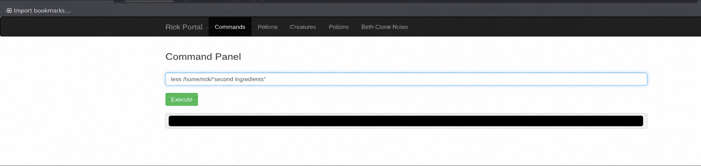

**Second ingredient:** `[REDACTED]`

## Privilege context and the final ingredient

Before accessing `/root`, I checked which operating-system account was executing commands through the web portal.

```bash
whoami
```

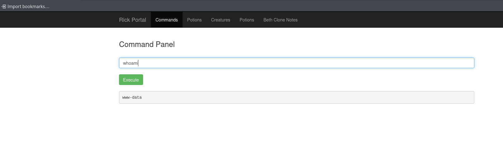

The output was `www-data`, confirming that commands were running as the restricted web-service account.

To determine whether the web-service account could execute commands with elevated privileges, I tested access to the root user's home directory using `sudo ls /root`. The command executed successfully without requesting a password, demonstrating that the web-service account could use `sudo` to access privileged resources. Because a complete `sudo -l` output was not captured, the exact scope of the account's sudo permissions was not verified.

```bash
sudo ls /root
```

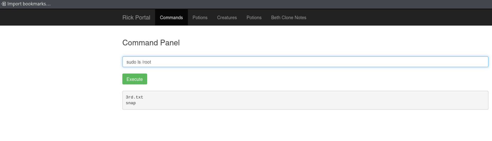

The directory contained `3rd.txt`, so I read it with the same elevated privileges.

```bash
sudo less /root/3rd.txt
```

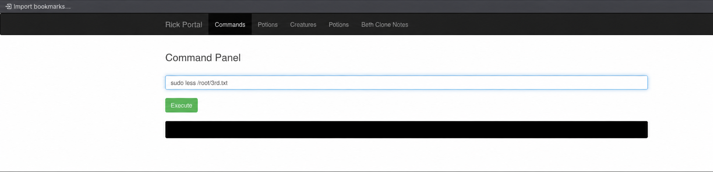

**Final ingredient:** `[REDACTED]`


## Security findings

- Username disclosure through an HTML comment
- Sensitive information exposed through `robots.txt`
- Authenticated operating-system command execution
- Excessive sudo privileges assigned to the web-service account
- Insufficient separation between the web application and privileged system resources

## Remediation

- Remove sensitive information from HTML comments.
- Never store credentials or secrets in `robots.txt`.
- Do not pass user-controlled input directly to operating-system commands.
- Replace shell execution with narrowly scoped server-side functions.
- Run the web service with the minimum required privileges.
- Review and remove unnecessary sudo permissions granted to `www-data`.

## Lessons learned

This room demonstrated how several small weaknesses can be chained together. Information disclosure provided valid credentials, the authenticated command portal enabled filesystem enumeration, and excessive sudo privileges allowed access to files owned by the root user.

---

This writeup documents activity performed only inside the authorized TryHackMe lab environment.
